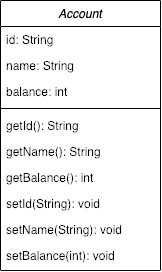
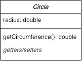
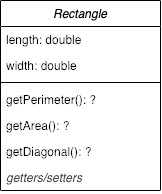
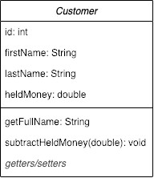
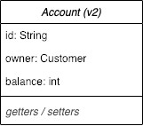

# Classes in Java exercise

Object Oriented Programming starts with Classes and Classes start with UML (Unified Modelling Language) diagrams. Designing and planning out programs is a vital skill and so we'll be pushing the use of UML diagrams across the course. Not only are they easy to parse, giving a good idea of your application and how it ties together, but by planning out your classes in this fashion ensures that you've considered these relationships ahead of time.

This exercise will focus on the creation of a few POJOs (Plain Old Java Objects), each with some associated `get` and `set` methods as indicated, alongside how we can extended these POJOs with our own methods.

We'll manually test out our methods within our `main()` method, simply printing the results to the console.

Remember to create a new Java project for each set of exercises! Keep all the following classes in one folder.

**Note:** for some of these exercises, you will be asked to refactor parts of your earlier code. Instead of entirely removing this code, we recommend you comment it out instead using `//` (inline commenting) or `/* */` (multi-line commenting)


## Example: Let's create an `Account` class



- Create a new Class file within your `src/` directory, alongside the `Main` class named `Account`
- Add in the properties of `Account` as outlined in the UML snippet above
- Override the `toString()` method to print out a clear representation of our `Account` object
- Create a new `Account` object in your `Main` class
- Try printing out the whole `Account` object, also test out the getter functions

**HINT:**

Override a method -

```
@Override
public String toString() {
    return "Account{" + "id='" + id + ", name='" + name + ", balance=" + balance + '}';
}
```

Making use of getters in Main -

```
Account myAccount = new Account("1", "Johnson", 300);

int myBalance = myAccount.getBalance();
```

Printing to the console - 

```
System.out.println(myBalance);
```

**Note:** for the following UML class diagrams, we are going to hide the POJO Getter and Setter methods simply behind *"getters/setters"*. You are still expected to implement these classes.


## A Circle class, Getters and Setters

_MVP 1/3_



Our `Circle` class only has one property of `radius`. Build out this class akin to how we did for `Account` above. Remember your getter and setter for the `radius` property! You may find it useful to override the `toString()` method at this point.

**NOTE:** here that we have extended our `Circle` to include a novel method which houses some logic, `getCircumference()`.

- Using `π` as `Math.PI`, think about how we can use some simple mathematics within our method to _return_ a value for our circumference

A circle's circumference is equal to `2 x radius x π`.

- Play about with the two `get` methods you have created before moving onto the next section
- Now create a `setRadius()` method which accepts a `double` value and sets the radius of the provided object to the new value
- Give your setter function a go! What happens if you call your `getCircumference()` method after setting a new `radius` value?


## Now for a Rectangle

_MVP 2/3_



This time around, our initial values are of type `float`. Can you remember the difference between a `double` and a `float`?

- Create a new Class `Rectangle` with the properties `length` and `width`. Remember to create a constructor!
- Create getters and setters for your two properties of `length` and `width`
- Next, create the novel methods of `getPerimeter()`, `getArea()` and `getDiagonal()`
- Test out each of these methods within `main()`

**NOTE:** We haven't given you the _return type_ of the last three methods. Think back to our teaching of types, what types could we specify here? Test out a few to see what the IDE will accept.


## A Real-World Example of a Customer

_MVP 3/3_



Our previous examples have focussed on fairly abstract classes which you wouldn't likely encounter in real life. The concept of storing **customer information**, however, is prevalent and relatable. 

- Using the UML diagram above, create a `Customer` POJO class 
- Envision and then implement the additional methods `getFullName()` and `subtractMoneyHeld()` suggested by name in the UML diagram
- Change around your constructor to make use of a randomised integer value between 1 and 1000 instead of accepting a `String` input value for the `id`
- Create your own novel method within the `Customer` class. Feel free to create any additional properties as needed. Remember to include a `get` and `set` method for any new properties and to modify your `toString()` method if needed

**Note:** there are a couple different ways you can generate random numbers in Java. Have a search online to see what exists!


## Tying our `Account` to our `Customer`

_Extension 1_



We'll have deeper look into how we store and associate data come the SQL module, however Object Oriented Programming (OOP) leans on this latter topic as well. Creating links, or relationships, between objects in your application is the step needed to turn simple lines of code into a greater application. Let's now make use of our earlier `Account` and `Customer` classes to create a link from one to the other, where each _account_ has an associated _customer_.

- Have a look at the modified UML diagram for `Account` above. Notice how the we have changed the `name` property into an `owner` which if of `Customer` type. How can you change around your `Account` class to accommodate this change? Give it a go
- Try creating a new `Account` which makes direct use of a pre-defined `Customer`
- Do we have to change about the order of our created objects within the `main()` method?
- Why do you think this is?
- We're now storing amounts of money within both `Account` and `Customer`. Have a think and refactor your code to include only one of of these properties in your application depending on which you think makes most sense. Comment your reasoning the below relevant constructor 


## Allowing user input

_Extension 2_

The final piece of this lab is to allow for some user input within your application. You can do this by introducing a **Scanner**.

- Create an instance of a Scanner within your application to accept user input from the terminal
- Allow the user to specify the `name` (and any additional initial values you would like) for the `Customer` class
- Next, create a method similar to the `subtractHeldMoney()` seen earlier, making use of some user input to update the value of `balance` in your created `Account`
- Finally, make use of a `while` loop to allow for the user to _add_ **and** _subtract_ values from the `balance` until an end condition is inputted into the terminal, _e.g._ `"exit"`