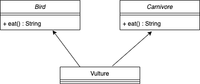

# Inheritance

#### Lesson duration: 180mins (3 hrs)

### Learning Objectives:

- Be able to define polymorphism as it relates to object-oriented programming
- Understand how to implement inheritance in Java
- Be able to override a method
- Understand what an *abstract class* is
- Understand what an *inheritance chain* is
- Understand how to use the `protected` access modifier

Even with meticulous planning we will often find ourselves in situations where there is a lot of repetition in our code. Some of that may be down to subtle differences in what is needed from various methods, some of it may be due to strong similarities between two or more classes. In some cases we may be able to find a level of abstraction such that we can define a single class with those shared properties and behaviours, but this comes with its own problems.

Having a class with a suitable broad definition can lead to extra properties being required. For example, if we were to define a `Vehicle` class we would need a property telling us if it was a car, train or rowing boat. We would also have some difficulty with the behaviours; it makes sense for a boat to have a `row()` method, but that would be nonsense for a train. That suggests that one broad class is a bad idea, but it *does* make it possible to define shared attributes in one place. In an ideal world we would have a way to define each of our vehicles separately but also show that they share those attributes.

In object-oriented programming this ideal way is called **polymorphism**. From the Greek words *poly* and *morph* ("many" and "forms"), if we implement our classes in such a way as to make them *polymorphic* we make it possible to refer to them by **more than one data type**. In this lesson we will look at one of the common ways of doing this: **inheritance**.


## A World Without Inheritance

In this session we are going to model a zoo with classes representing the animals, the enclosures and the zoo itself. The UML diagram for our three classes is shown below.


> Open the start point, run the tests and compare the code to the UML

Our zoo is pretty simple at the moment: the `Zoo` has three `Enclosure`s and each `Enclosure` has a collection of `Animal`s. The only differences between the `Animal` objects are the values associated with their properties. That's partly why our code can be so simple, since we only have to worry about one type of object at each level. It can lead to some potentially unwanted behaviours though. Let's create a different type of `Animal` and add it to the same enclosure.

```java title="EnclosureTest.java"
// EnclosureTest.java

@Test
public void canAddMultipleAnimals(){
	Animal lion = new Animal("Simba", "lion");
	Animal parrot = new Animal("Iago", "parrot");
	enclosure.addAnimal(lion);
	enclosure.addAnimal(parrot);
	int expected = 2;
	int actual = enclosure.countAnimals();
	assertEquals(expected, actual);
}
```

The test passes, as it should given our current setup. Should it, though? Is having lions and parrots in the same enclosure a good idea? Although this is a slightly contrived example it represents a real-world problem: although two objects may share a data type there could be good reasons to *not* have them together in a collection. We could modify the `addAnimal` method in `Enclosure` to check that the new animal has the correct type before adding it. The `Enclosure` class could accept *anything* at first so we can't just put a blanket restriction on it, we need to compare the new animal to those already there - if there's anything to compare it to. Our method would end up looking something like this:

```java title="Enclosure.jva"
// Enclosure.java

// ...

public void addAnimal(Animal animal){
	// if there are already animals...
	if (!this.animals.isEmpty()){
		// ...loop through the existing animals
		for (Animal existingAnimal : this.animals) {
			// compare each animal's type to the new animal's type
			if (!existingAnimal.getType().equals(animal.getType())){
				// if they're not the same break out of the function
				return;
			}
		}
	}
	// only add the new animal after completing those checks
	this.animals.add(animal);
}
```

Our test now fails, which means we can't add animals of different types to the same enclosure any more. It's taken a lot of extra code to get there though and only solves the problem for one method. Having distinct `Lion` and `Parrot` classes could help but would also lead to extra code, we would have to define an `addLion()` method and an `addParrot()` method, plus have a collection for each. The solution lies in polymorphism. By making our classes polymorphic we will be able to denote them as `Animal`s and `Lion`s (or `Parrot`s) simultaneously, meaning we can rely on the compiler's type-checking to solve many of these problems for us.

## Adding a Child Class

When we implement **inheritance** we are defining a relationship between two classes. One class becomes a **parent** (or **superclass**) and defines some baseline properties and behaviours, the other becomes a **child** (or **subclass**) and can either use those baselines, expand on them or replace them with its own definition. The child class *inherits* everything defined within the parent, crucially including the type.

We will add our first polymorphic class by defining a `Lion` using the `extends` keyword. By including this in the class declaration we specify that `Lion`will be a subclass of whatever it extends, in this case `Animal`.

```java title="Lion.java"
// Lion.java

public class Lion extends Animal{
        
}

```

Our compiler immediately throws an error, telling us that we have "no default constructor" available to us. Previously we could have instantiated a new `Lion` without defining a constructor but since we are extending `Animal` the definition for the constructor is passed down to `Lion`. We can't use it explicitly though, that would just create another `Animal` object. First we will edit `Animal` to remove the `type` property (since that is now redundant) before using the constructor inside `Lion`.

```java title="Animal.java"
// Animal.java

public class Animal {

    private String name;
    private boolean healthy;

    public Animal(String name) {
        this.name = name;
        this.healthy = true;
    }
    
    // remove getter and setter

```

> Also need to update tests

```java title="Lion.java"
// Lion.java

public class Lion extends Animal{
        
	public Lion(String name) {
   		super(name);
   	}
        
}
```

When we create a new `Lion` object this constructor will be called, but since `Lion` is extending `Animal` and taking on the additional data type we also need to call the `Animal` constructor to handle those properties. The `super` method enables us to pass certain values, either passed as arguments or hard-coded, up to the superclass' constructor. By doing this we give `Lion` all of the properties and all of the behaviours defined in `Animal`. We can confirm it by writing a test file specifically for `Lion`.

```java title="LionTest.java"
// LionTest.java

public class LionTest {

	private Lion lion;

	@BeforeEach
	public void setup(){
		lion = new Lion("Simba");
	}

	@Test
	public void canMakeNoise(){
		String expected = "Hello, my name is Simba.";
		String actual = lion.makeNoise();
		assertEquals(expected, actual);
	}

	@Test
	public void canEat(){
		String expected = "Mmm, that was tasty!";
		String actual = lion.eat();
		assertEquals(expected, actual);
	}

}
```

The tests pass even though neither behaviour has been explicitly defined for `Lion`. Note also that `makeNoise()` depends on a property which hasn't been defined either. Everything defined for `Animal` works for `Lion` too. Giving objects multiple data types in this way sets up what is known as an **"is a"** relationship - a `Lion` *is an* `Animal`. This only works one way, we can't say that an `Animal` *is a* `Lion`.

We aren't limited to the properties defined in the parent class. A subclass can add its own properties and behaviours exclusive to it. We can add them in the same way as if there was no inheritance, the only restriction is that the `super()` call *must* be the first thing in the body of the constructor.

```java title="Lion.java"
// Lion.java

public class Lion extends Animal{

	private boolean canWaitToBeKing;
        
	public Lion(String name, boolean canWaitToBeKing) {
   		super(name);
   		this.canWaitToBeKing = canWaitToBeKing;
   	}
        
}
```

## Overriding a Parent's Behaviour

Often we will find ourselves in a scenario where we want a subclass to be able to do something defined in the superclass, but not necessarily in exactly the same way. Our `Lion` is a case in point, maybe we don't want it to greet us by saying its name? Maybe instead we want to return a more appropriate noise for all lions, but we can't redefine `makeNoise()` in `Animal` without affecting everything which extends it. Instead we will **override** the method in the subclass.

```java title="Lion.java"
// Lion.java

public class Lion extends Animal{

	// ...
	
	@Override
  	public String makeNoise() {
   		return "ROAR!";
   	}
        
}
```

We define a method with a matching signature in the subclass, but we can redefine the method body however we wish (so long as the return type remains the same). Now when we call `makeNoise()` on a `Lion` object this version will be invoked instead of the default defined in `Animal`. That behaviour isn't lost, we can access it at any point by calling `super.makeNoise()` to call the superclass' definition. 

The `@Override` annotation here is slightly unusual when compared to other annotations. Usually an annotation indicates to the compiler and/or interpreter that some extra functionality is associated with a property or method but not in this case. `@Override` is purely cosmetic and acts as an indicator to users that the class is overriding a parent's method. If we omit it there will be no problem, however if we add it to a method which *doesn't* override anything we will see a warning at compile time.

When we re-run our tests we see that `LionTest` now fails, meaning the updated behaviour is being used. `AnimalTest` still passes, since the objects we create there have the `Animal` type and use the original definition. 

We have added a new class and so need to update our diagram to include it. When showing inheritance in UML the superclass and subclass(es) should be linked by an arrow with an empty arrowhead pointing from the subclass to the superclass. Any additional properties and methods should be included, along with any methods being overridden. Our updated diagram is shown below.


## Abstract Classes

As things stand there's a bit of a disparity between the lions and the parrots. We have a `Lion` class for the lions but the parrots (and anything else) need to use the `Animal` superclass. We need to fix that by adding a `Parrot` class, including an override for `makeNoise`, plus some tests for it.

```java title="Parrot.java"
// Parrot.java

public class Parrot extends Animal{

	public Parrot(String name) {
		super(name);
	}

	@Override
	public String makeNoise() {
		return "Squawk!";
	}

}
```

```java title="ParrotTest.java"
// ParrotTest.java

public class ParrotTest {

  	private Parrot parrot;

   	@BeforeEach
   	public void setup(){
   		parrot = new Parrot("Iago");
   	}

   	@Test
   	public void canMakeNoise(){
   		String expected = "Squawk!";
      	String actual = parrot.makeNoise();
      	assertEquals(expected, actual);
   	}

   	@Test
   	public void canEat(){
   		String expected = "Mmm, that was tasty!";
      	String actual = parrot.eat();
      	assertEquals(expected, actual);
   	}

}

```

We can continue this process for any new kind of animal we want to add. That leaves `Animal` in a strange position - we need the class to act as a superclass, but we never want to make `Animal` objects. In the real world we can't picture something we would describe as simply "animal", instead we would talk about "lions", "parrots" or anything else. In programming terms we have similar scenarios where we only want to think in terms of a *concrete* implementation of something rather than an *abstract* concept.

In the real world we can't produce an abstract "animal", but in our code it's still possible to create an instance of the `Animal` class. To prevent a user from being able to do this we can modify the class declaration by adding the `abstract` keyword. This will prevent us calling the constructor from anywhere in the program other than via the `super()` method in a child class, effectively making it a "non-access" modifier.

```java title="Animal.java"
// Animal.java

public abstract class Animal {

    // ...

}

```

We have made `Animal` an **abstract class**, resulting in our compiler throwing errors in our test files telling us that "Animal is abstract, cannot be instantiated". To fix this we will need to replace the instances of `Animal` with either `Lion` or `Parrot` as appropriate.

> `EnclosureTest.canAddAnimal` - replace `new Animal("Simba")` with `new Lion("Simba", false)`
> 
> `EnclosureTest.canAddMultipleAnimals` - replace `new Animal("Iago")` with `new Parrot("Iago")`
> 
> `ZooTest.canAddAnimalToEnclosure` - replace `new Animal("Simba")` with `new Lion("Simba", false)`
> 
> Delete `AnimalTest.java`

Note that we only need to edit the lines where we instantiate the objects - we haven't edited any of the methods using them. We may not be able to create `Animal` objects directly but it still exists as a data type so can stay in any method signatures. 

Testing an abstract class is tricky and best achieved by testing the concrete implementations of it. Since methods can be overridden and properties managed in different ways be each subclass it is important to test each of them.

We can indicate that a class is abstract in UML in a couple of ways. In printed diagrams the name of the class is often italicised, but this doesn't translate well into hand-drawn diagrams where a double set of angle brackets is often seen. The two are used interchangeably and sometimes together, as in our updated diagram below.


## Chaining Inheritance

Polymorphism doesn't just mean "two forms", remember it comes from the Greek for "*many* forms". In our code we aren't limited to a class having two data types, they can have as many as they need to within the constraints of our design. As we add more and more animals to our zoo the need for this becomes more apparent.

Let's expand our selection and add another type of bird.

```java title="Seagull.java"
// Seagull.java

public class Seagull extends Animal{

	public Seagull(String name) {
 		super(name);
   	}

   	@Override
   	public String makeNoise() {
   		return "MINE!";
   	}
}
```

So far so good, but eventually we're going to get back to a situation where we are repeating a lot of code between `Parrot`, `Seagull` and any other bird classes we create. We have a method for abstracting away shared methods, but we can't move any bird-specific behaviour up to `Animal` or *every* subclass of `Animal` will inherit that behaviour. We can, however, add another superclass between our birds and `Animal` which every bird can inherit from.

We'll call this class `Bird` and have it extend `Animal`. `Parrot` and `Seagull` will in turn extend `Bird`. At first we will notice no difference but we now have an extra place in which to define properties and behaviours. For example, we could have our birds lay eggs.

```java title="Bird.java"
// Bird.java

public abstract class Bird extends Animal{

   	public Bird(String name) {
   		super(name);
  	}
    
   	public String layEgg(){
   		return "I laid an egg!";
   	}
}

```

`Bird` has been declared `abstract` since it makes no sense for us to be able to create birds in the same way as it makes no sense to create animals. Anything extending `Bird` has access to this new method *and* everything defined in `Animal`, as we can demonstrate through tests.

```java title="ParrotTest.java"
// ParrotTest.java

public class ParrotTest {

  	// ...

   	@Test
   	public void canLayEgg(){
   		String expected = "I laid an egg!";
      	String actual = parrot.layEgg();
      	assertEquals(expected, actual);
   	}

}

```

Our UML can be updated with as many layers of inheritance as necessary.


Repeated extension of classes like this is called an **inheritance chain** and is very common, in fact it underpins the relationship between some of the data structures we have already worked with. It should be handled with care though, as long chains can become difficult to manage and inadvertently lead to bugs.


## Limitations of Inheritance

Inheritance isn't a cure-all for our type-related problems. It is a very powerful tool but is limited in its application, particularly if we find ourselves in a scenario where multiple parent classes could be useful.

Consider a scenario where we add a `Carnivore` abstract class into the mix. Some animals are meat-eaters, some are not, so we can't have any `Carnivore` behaviours directly inside our existing inheritance chain. If we add a `Vulture` class we need it to extend both `Bird` and our new `Carnivore` class but doing so could lead to conflicts. Consider this UML diagram:



`Vulture` needs to extend both of those classes - it's both a `Bird` and a `Carnivore` - but extending both means inheriting *everything* from both, meaning two implementations of the `eat()` method! In Java this is far from ideal, we want our programs to have a single unambiguous definition for each method. This is known as the **diamond problem** and Java's solution to it is to limit the number of parents a child can have to **one**. Some other languages permit multiple inheritance and require much stricter management of their objects than Java does. While we may not be able to inherit from multiple classes, we can use **interfaces** as a partial solution to the problem and we will discuss these in a future lesson.

We also have to consider the interaction between properties defined in a superclass and methods defined in a child. Let's try adding a `sayName()` method to our parrots.

```java title="Parrot.java"
// Parrot.java

public class Parrot extends Animal{

	// ...
	
	public String sayName(){
 		return String.format("My name is %s.", this.name);
   	}
   	
}
```

Our compiler is throwing an error, but why? We know that `Parrot` objects have a name, we can call `parrot.getName()` and see a result, but accessing the property is the problem here. The name property has `private` access in `Animal`, which means it can only be accessed from within an `Animal` object. Although a `Parrot` *is an* `Animal` the access modifier means the property can only be *directly* accessed by an object created using the `Animal` constructor, which means it won't have access to the `Parrot` methods. 

There are two ways in which we can solve the problem. The first is to use the getter to retrieve the value, but while this will work in this case with a String it may lead to issues with more complex data structures, or indeed lead to some very messy code. The alternative is to change the access modifier and that it the approach we will take here. Instead of `name` being `private` we will make it `protected` in `Animal`:

```java title="Animal.java"
// Animal.java

public abstract class Animal {

    protected String name;
    private boolean healthy;

    // ...
}
```

The `protected` modifier sits between `private` and `public` in terms of visibility. A property (or method) with it can be accessed from other classes, but **only those which inherit** from where the value is defined. We need to make a small adjustment to our UML diagram as well, replacing the `-` symbol with a `#`.
