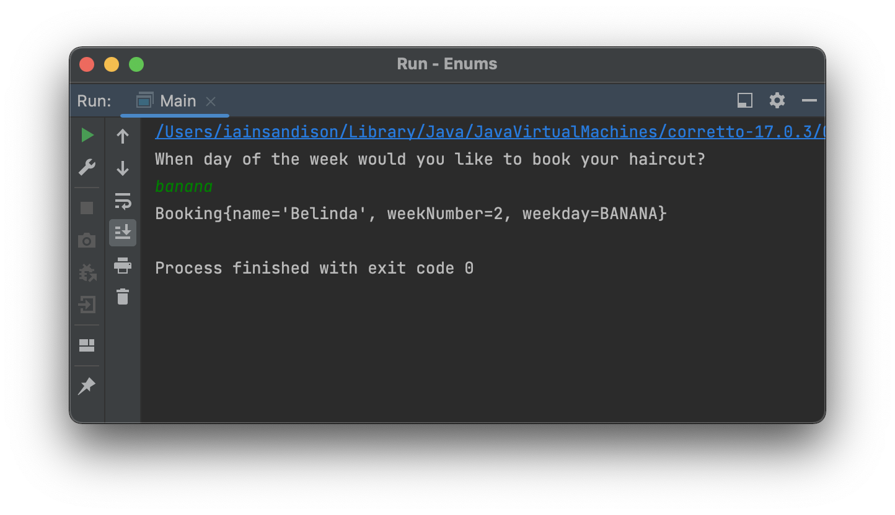
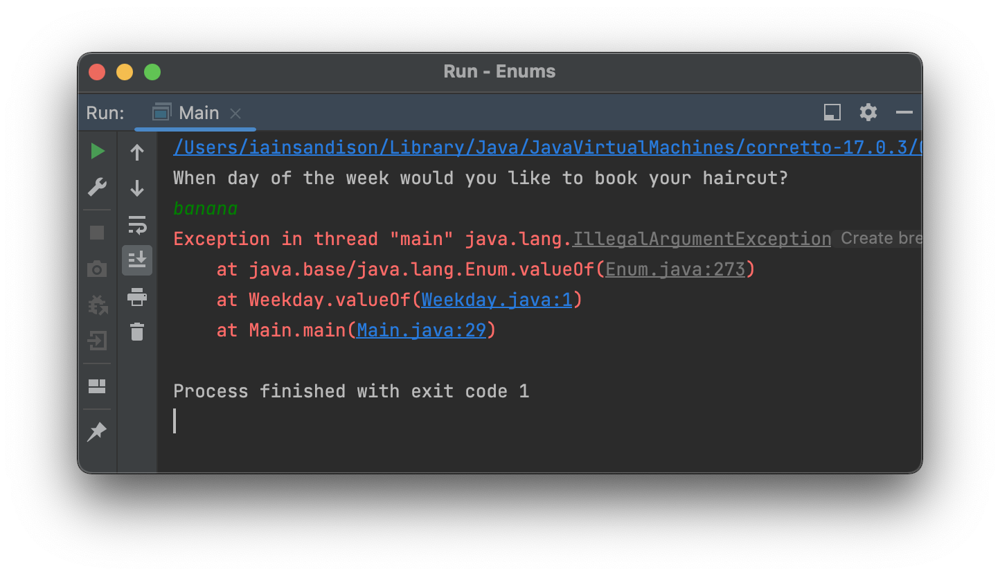

# What is an Enum?

Once you begin creating your own methods, you will likely bump into the need for **restriction on what is being supplied as an argument**. This is especially true when building up a CLI (Command-line-interface) application with some guided user input. Of course, we already handle placing restrictions of our arguments by declaring their types within our method signature, however what if `String` is too broad a declaration? Say, instead, we only want to accept inputs from a **specific list** of strings? 

**This is where "enumeration types" or "enums" for short, come in.**

Enums are a means for creating **a finite set of related constants** which can be referenced later within your application. They are created in IntelliJ akin to a class, but as they generally belong to a *package* and not *another class*, they are often placed in their own files. A simple enum type for accepted answers within a flowchart is shown below:

```java
public enum Answer {
	YES,
	NO,
	MAYBE
}
```

By implimenting this enum, we place the restriction on accepted inputs on the signiture of the method, rather than the functionality within, saving ourselves some code at this point. This path does require the use of an exception to handle gating at this level but we don't need to worry about that just yet!

To make use of this enum within a method, we would simply need to specify the argument (or other variable) type as `Answer` and then assign the value by calling the enum name and then the value joined with a dot `.`

```java
public ourMethod(Answer inputAnswer) {
	...
}

ourMethod(Answer.YES);
```

Another common example for where you may create an enum type is when handling the days of the week:

```java
public enum Weekday {
	MONDAY,
	TUESDAY,
	WEDNESDAY,
	THURSDAY,
	FRIDAY,
	SATURDAY,
	SUNDAY;
}
```

Note that in both of these examples, the list of values is a list of `String` type values. These values can be used further in our application akin to any other string value, but their initial definition has to come from our enum list.


## Example - A Good Day for a Haircut

Let's say we have a rudimentary haircut booking command-line app that works through the combination of a week number and a day of the week (*e.g.* `Booking{name='Belinda', weekNumber=2, weekday=THURSDAY}`). User input is being handled by a Scanner.

Ignoring the week number and customer name at the moment, the user will be asked to supply the name of the day of the week they would like their haircut on. If we accept any old `String` input, we may end up with someone booking their haircut for the day `"banana"` which is obviously going to create complications.

```java
public class Booking {

    private String name;
    private int weekNumber;
    private String weekday;

    public Booking(String name, int weekNumber, String weekday) {
        this.name = name;
        this.weekNumber = weekNumber;
        this.weekday = weekday;
    }
    
}
```



By creating our enum type of `Weekday` as above and making use of it within the `Booking` class, however, we can introduce some restriction on what is a valid value:

```java
public class Booking {

    private String name;
    private int weekNumber;
    private Weekday weekday;

    public Booking(String name, int weekNumber, Weekday weekday) {
        this.name = name;
        this.weekNumber = weekNumber;
        this.weekday = weekday;
    }
    
}
```



**NOTE:** the `main` method is making use of the `.valueOf()` method here to convert the String input to an enum value, if valid.

If we run the application again and supply the value `monday` we can see that it is accepted and an instance of the `Booking` class is printed to console:


## Switches, Loops and Conditionals

### Switch Statements

Enums make for fantasitc bases for `switch` statements. When you have a defined list of potential pieces of functionality, each tied to a separate value, enums naturally lend themselves well. Taking the same `Weekday` example from earlier, we can construct a `switch` statement like so:

```java
switch(weekday) {
    case MONDAY:
        System.out.println("Mondays are gross");
        break;
    case TUESDAY:
        System.out.println("Tuesdays aren't much better");
        break;
    case SATURDAY:
    case SUNDAY:
        System.out.println("Weekend time!");
    default:
        System.out.println("Is it the weekend yet?");
}
```

### Loops

Enums are also easy to loop over, affording us a means to _e.g._ provide the accepted values of a given enum type. This most often makes use of the `.values()` method inherent to enums, which returns an array containing each enum item in the order they're declared. Placing this into an enhanced for loop allows us to print each enum item:

```java
for (Weekday day : Weekday.values()) {
	System.out.println(day);
}

// MONDAY
// TUESDAY
// WEDNESDAY
// THURSDAY
// FRIDAY
// SATURDAY
// SUNDAY
```

### Conditionals

Making use of enums as part of a conditional statement is as you would expect:

```
Weekday day1 = Weekday.MONDAY;

isWeekend(day1);
// Nope, it's a plain old weekday

public static void isWeekend(Weekday day) {
    if(day == Weekday.SATURDAY || day == Weekday.SUNDAY) {
        System.out.println("Yay, it's the weekend!");
    }
    else {
        System.out.println("Nope, it's a plain old weekday");
    }
}
```

Remember that `if` statements are type specific so if you're attempting to compare the value of an enum item to a `String` value, you'll need to make use of the `.name()` method of enums alongside the `.equals()` method of strings:

```java
public static void isWeekend(Weekday day) {
	if(day.name().equals("SATURDAY") || day.name().equals("SUNDAY")) {
		System.out.println("Yay, it's the weekend!");
	}
	else {
		System.out.println("Nope, it's a plain old weekday");
	}
}
```


## Behind the Scenes

Earlier, we mentioned that an enum is akin to a class in Java. This is actually false. **Enums, in fact, are classes** in their own right, just created through slightly different means. Before the introduction of the `enum` keyword in Java 5, enums were created as a class containing a list of `final static` constants, which associated some descriptor to a value. In the below example we're associating the days of the week to integer values.

```java
Class Weekday {
	final static int MONDAY = 1;
	final static int TUESDAY = 2;
	final static int WEDNESDAY = 3;
	final static int THURSDAY = 4;
	final static int FRIDAY = 5;
	final static int SATURDAY = 6;
	final static int SUNDAY = 7;
}
```

You would then make use of this class by *e.g.* including it as part of a conditional check:

```java
if (providedWeekDay == Weekday.SATURDAY) {
...
}
```

**NOTE:** that here we are comparing two **integer** values. 

The problem with this format is that there is no restrictions placed on the initial value of `providedWeekDay` by the compiler, and hence it could concieveably fall outwith the bounds of 1 through 7. This means that you could pass **any** integer value to a method which is looking to accept only one which corresponds to a weekday as defined above.

This compromises the security of our application and hence requires significant input validation to be put in place as part of our front-facing functionlity. Now, this may seem easy enough to construct for an integer value, but what if we wanted to associate the constants within our pseudo-enum to strings? We would have to create a weighty conditional statement which checked whether the provided value is equal to a list of pre-defined values.

Ultimately, it's feasible, but it undercuts one of the largest strengths held by statically-typed languages: intrinsic value validation.


## Enums are Classes

But what does it matter that enums are classes in disguise?

Just like classes, enums can contain greater information than a simple list of constants. Additionally, both **constructors** and bespoke **methods** can be created and utilised by other classes, just as we've seen plenty times previously.

Each enum item created at the beginning of our enum file (_e.g._ `MONDAY` or `TUESDAY`) is actually an instance of the base class `Weekend` with different `name` properties. Each instance **extends** Enum<Weekday>.

### Enum Methods

Before venturing into how we can build out our list of constants within our enum to house additional properties, let's take a look at creating a simple method. When we've called the value such as `Weekday.SATURDAY` within our `main()` method previously, you'll have noticed that what is returned is entirely capitalised. This is as our initial values are entirely uppercase, owing to being constants and hence required by convention to be so.

This has the benefit, of course, of ensuring that we know we're handling a constant value but say we want these values printed in a different format. Say we want each String with only the first letter capitalised, for instance.

```java
public String capitalise() {

    String firstLetter = this.toString().substring(0, 1).toUpperCase();
    String capitalisedString = firstLetter + this.toString().toLowerCase().substring(1);
    
    return capitalisedString;
}
```

**Note:** that here we've made use of the `.toString()` method to further make use of their intrinsic methods such as `.substring()`. We could have optionally made use of the `.name()` method of Enums. Note also that the use of the `this` keyword allows us to keep this method abstracted.

We would make use of our method elsewhere in our application simply as we would another method:

```java
System.out.println(Weekday.SUNDAY.capitalise());
// Sunday
```

### Constructors and Additional Properties

One of the powerful behaviours of enums which is uncommonly utilised is how you can assign multiple properties to each constant, effectively creating something approaching an object for each touchpoint.

Your hairdressing agency has done exceptionally well and it's time to move internationally. After some hot debates, you've settled on opening up your next branch in Germany. The only problem is, your booking system only prints out the days of the week in English! Let's see how we could add in an additional *property*. We'll only focus on the first couple days of the week for now to keep things concise:

```java
public enum Weekday {
	
	MONDAY("Montag"),
	TUESDAY("Dienstag"),
	...;
	
	public final String german;
		
	Weekday(String german) {
		this.german = german;
	}
	
  
}  
```

While it is illegal to use the `new` keyword with an enum, we can still make use of a `constructor` like for any other class. Making use of this additional property is super easy:

```java
System.out.println(Weekday.MONDAY.german);
// Montag

System.out.println(Weekday.MONDAY.french);
// null
```

Note above how we've also shown an example where we've attempted to gain the value of `.french` which returns `null`. 

### Finding Items by the Value of a Property

We can find a specific enum item from a provided value by creating a `static` lookup method as so:

```java
public static Weekday valueFromGerman(String german) {
    for (Weekday e : values()) {
        if (e.german.equals(german)) {
            return e;
        }
    }
    return null;
}
``` 

## Additional Resources

[https://www.baeldung.com/java-enum-iteration](https://www.baeldung.com/java-enum-iteration)
[https://www.baeldung.com/java-enum-values](https://www.baeldung.com/java-enum-values)
[https://www.javajee.com/blog/enums-in-java-with-examples-advantages-use-cases](https://www.javajee.com/blog/enums-in-java-with-examples-advantages-use-cases)
[https://docs.oracle.com/javase/tutorial/java/javaOO/enum.html](https://docs.oracle.com/javase/tutorial/java/javaOO/enum.html)


