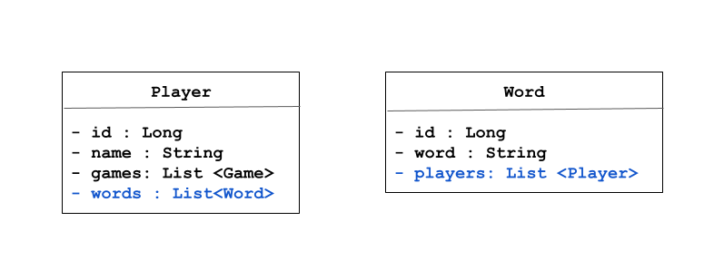

# Spring - Many to Many

#### Lesson duration: 180mins (3hrs)

### Learning Objectives
- Understand the many-to-many relationship
- Know how to implement Jpa Repository annotations in order to map the many-to-many relationship

## Intro
In the process of saving objects to our databse, we want to ensure that any relationships they might have to other objects are preserved. We have recently seen how we can do this to maintain a one-to-many relationship in our database by using Jpa Repository annotations correctly. 

For example, we could potentially query our database to discover the following:
- Given a specific player, how many game(s) have they participated in?
- Given a specific player, what was their average number of guesses before arriving at the correct word?

We are now going to do the same with a many-to-many relationship.

### Words & Players: many-to-many
Let's re-examine the objects we have and the relationships between.

Currently, the tables in our `word_guesser` database look like the following:

games
| id | complete | guesses | word      | player_id |
|----|----------|---------|-----------|-----------|
| 1  | true     | 7       | hello     | 2         |
| 2  | false    | 4       | interface | 1         |
| 3  | true     | 10      | data      | 2         |

players
| id | name  |
|----|-------|
| 1  | Mabel |
| 2  | Betty |


We are going to introduce a new relationship to our game. It's possible that in our game, a player may wish to know all the words that they have guessed over time. This relationship could be a many-to-many. *A word can be given to many players; a player can be given many words.* 

Every time a game is played, we could introduce a table that would record all the words that each player plays. 

words
| id | word      |
|----|-----------|
| 1  | hello     |
| 2  | interface |
| 3  | data      |

Now we have a table that records `players` and `words`, but how should we link the two tables to data together? The answer is a join table, which will link words and players via their foreign keys. We will call this table `players_words` and it could look like this:

players_words
| player_id | word_id |                    |
|-----------|---------|--------------------|
| 2         | 1       | (Betty, hello)     |
| 1         | 2       | (Mabel, interface) |
| 2         | 3       | (Betty, data)      |
| 1         | 1       | (Mabel, hello)     |

As you can see from this sample data, it is possible to see how a `Player` can have many words (in this example Betty has two words: `hello` and `data`) and a `Word` can have many players (Both Betty and Mabel have played `hello`).

We can now take another look at our class diagram. Now that we are keeping track of of words for players and players for words, we need to add some additional properties to the models: `players` in our `Word` class and `words` in our `Player` class.




In summary:

A player should have many words
- `Player` should contain a list of `Word`s
- `Player` should have something that sets up one side of the join table `players_words`

A Word should have many Players
- `Word` should contain a list of `Player`s
- `Word` should have something that sets up the `word_id` in the `players_words` table

Now we understand the relationship we are trying create, we can start to code.

### Add a `Word` class
Right-click on the `models` package and create a new class called `Word`. Our new class is a simple class with only three properties: `id`, `word` and a list of `players`, which needs to follow the POJO rules. 

**TASK (5mins)**
Using your new-found knowledge, spend a little time creating and annotating your new class. Leave the annotations for the `players` property for now. 
Don't forget:
- constructors
- getters and setters
- to instantiate your arraylist in your constructor

**Solution**
```java
// models/Word.java

@Entity(name = "words")     // note: easy to forget this annotation
public class Word {

    @Id     
    @GeneratedValue(strategy = GenerationType.IDENTITY) 
    private Long id;

    @Column(name = "word") // name argument optional
    private String word;

    // TODO
    private List<Player> players;

    public Word (String name){
        this.word = word;
        this.players = new ArrayList<>();
    }

// default constructor
    public Word (){

    }

// GETTERS & SETTERS
}
```

### Annotating the `players` property
Many players should have many words
The annotation for this is `@ManyToMany` and is typically used to annotate the properties of a class (or sometimes the property's getters). Usually this is a property of the type `Collection`, `List` or `ArrayList`.

The second annotation required is `@JoinTable` and this is used to set up the join table (`players_words`).

Finally, we must also tell JPA which columns we want in the join table and a `@JoinColumn` needs to be passed to `@JoinTable` via the `joinColumns` argument. We should consider the class we are in (`Word`) when we are naming our columns.

Our annotations for the `players` property should look like this:

```java
// models/Word.java

@Entity(name = "words")  
public class Word {

    @Id     
    @GeneratedValue(strategy = GenerationType.IDENTITY) 
    private Long id;

    @Column(name = "word") // name argument optional
    private String word;

    @ManyToMany     // ADDED
    @JoinTable(     // ADDED
        name = "players_words",
        joinColumns = {@JoinColumn(name = "word_id", nullable = false)}
    )
    private List<Player> players;

    // ...
```

Remember, though, that we must also map the inverse relationship with the `inverseJoinColumns` argument. From the point of view of the `Word` class, this is `player_id`.

```java
// models/Word.java

@Entity(name = "words")  
public class Word {

    @Id     
    @GeneratedValue(strategy = GenerationType.IDENTITY) 
    private Long id;

    @Column(name = "word") 
    private String word;

    @ManyToMany     
    @JoinTable(     
        name = "players_words",
        joinColumns = {@JoinColumn(name = "word_id", nullable = false)},
        inverseJoinColumns = {@JoinColumn(name = "player_id", nullable = false)}  // ADDED
    )
    @JsonIgnoreProperties({"words"})
    private List<Player> players;
    // ...
```
It is worth remembering that although this all looks complicated, all this is doing for us is making a table in the database called `players_words` with the columns `word_id` and `player_id`. The benefit from a developer's point of view, is that the underlying SQL statements are entirely handled for us. 
   
### Adding and annotating a `words` property in `Player`
Now that we have done one 'side', we can map the relationship from the other 'side': `Player`.

As discussed previously we should introduce another property to the `Player` class to keep track of the words a player has used. Let's add a `List` to our `Player` class and annotate it. 

Don't forget to add a getter and setter for your new `words` property.

```java
// models/Player.java

@Entity(name = "players")  
public class Player {

    @Id
    @GeneratedValue(Strategy = GenerationType.IDENTITY)
    private Long id;

    @Column(name = "name")
    private String name;

    @OneToMany
    private List<Game> games;

    @ManyToMany     // ADDED
    @JoinTable(     // ADDED
        name = "players_words",
        joinColumns = {@JoinColumn(name = "player_id", nullable = false)},
        inverseJoinColumns = {@JoinColumn(name = "word_id", nullable = false)}
    )
    @JsonIgnoreProperties({"words"})    // ADDED
    private List<Word> words;   // ADDED

    public Player(String name){
        this.name = name;
        this.games = new ArrayList<>();
        this.words = new ArrayList<>(); // ADDED
    }

    // ...

    public List<Word> getWords() {  // ADDED
        return words;
    }

    public void setWords(ArrayList<Word> words) {   // ADDED
        this.words = words;
    }
}
```
Let's run our application and have a look in Postico to see what our code has made for us.

In Postico, connect to `localhost` and select the `word_guesser` database. We should now see four tables instead of two: `players`, `games`, `words`, and `players_words`.

### Persisting our `Word` data and dealing with game logic
When we look at the `games` table it might be tempting to alter its `word` property to reflect a `Word` object (i.e. a column for a `word_id`). But much of our game logic depends on the `Game`s `word` property being a string.

Instead, when we start a new game, we should introduce our `Word` object to the 'behind-the-scenes' code.

#### WordRepository
Now that we are dealing with `Word`s in a database table, we will need a `WordRepository` interface to allow us to do all the useful things that JPA Repository allows us to do (CRUD, etc).

```java
// repositories/WordRepository.java

public interface WordRespository extends JpaRepository<Word, Long> {

}
```

#### Updating WordService
We can now make our `WordService` return a `Word` object. We no longer need to find a random word from `WordList` as our `Word`s now live in a table.

As we are dealing with saved `Word` objects, we can do away with injecting a `WordList` and instead instantiate a `WordRepository`.

We can also require our `getRandomWord()` method to return a `Word` instead of a String.

And finally, we now need to ask our method to return a random word from the database, rather than the `wordList`. We can do this by generating a random number we can as an id to pull a `Word` database object from our `words` table.

It so happens that the word list we will eventually provide you with is 50 words long, so we should pass in a `bound` argument to `nextLong()`.

`findById()` is given to us via the Jpa Repository interface.

```java
// services/WordService.java

@Service
public class WordService{

    @Autowired
    WordRepository wordRepository;  // MODIFIED

    public Word getRandomWord(){    // MODIFIED
        Random random = new Random();   //  ADDED
        long randomIndex = random.nextLong(50);     // ADDED
        return wordRepository.findById(randomIndex).get();  // ADDED
    }

}
```

#### GameService
When we return to GameService to review the logic behind `startNewGame()`, we should first of all change `targetWord`'s type to `Word`, as that is what `getRandomWord()` now returns. 

We can also update our line that instantiates a new `Game`. The `Game` constructor needs a String and a player to be passed in in order to work, so we will need to call `getWord()` on `targetWord` (which is now a `Word` object). `getWord()` will also need to be called when we are looking for the length of the word.

```java
// services/GameService.java

public class GameService {
    // ...

    public Reply startNewGame(long playerID){
        Word targetWord = wordService.getRandomWord();  // MODIFIED
        Player player = playerService.getPlayerById(playerId).get();
        Game game = new Game(targetWord.getWord(), player); // MODIFIED
        this.currentWord = Strings.repeat("*", targetWord.getWord().length()); // MODIFIED
        this.guessedLetters = new ArrayList<>();
        gameRepository.save(game);
        return new Reply(
                false,
                this.currentWord,
                String.format("Started new game with id %d", game.getId())
        );
    }
    
    // ...

}

```

#### Adding a `Player` to a `Word`
As we have resolved our non-compiling code, we can consider again the steps we need to happen when starting a new game now that we have a `Word` class with a link to the `Player` class.

Once we have extracted our `targetWord`, we need some way of adding our current player to the list of `players` in our `targetWord` object. Every `Word` has a list of players and `targetWord` is a `Word` object.

[could we add the word to the players arraylist instead??]

This means we will need an `addPlayer()` method in our `Word` class, which adds a `Player` to the `players` arraylist.

```java
// models/Word.java

@Entity
public class Word {
// ...
// Getters & Setters

    public void setPlayers(List<Player> players) {
        this.players = players;
    }

    public void addPlayer(Player player){   // ADDED
        this.players.add(player);
    }

}
```

Let's call this method in `startNewGame()`.

```java
// services/GameService.java

@Service
public class GameService {
    // ...

    public Reply startNewGame(long playerId){
        Word targetWord = wordService.getRandomWord();
        Player player = playerService.getPlayerById(playerId).get();
        targetWord.addPlayer(player); // ADDED
        Game game = new Game(targetWord.getWord(), player);
        this.currentWord = Strings.repeat("*", targetWord.getWord().length());
        this.guessedLetters = new ArrayList<>();
        gameRepository.save(game);
        return new Reply(
                false,
                this.currentWord,
                String.format("Started new game with id %d", game.getId())
        );
    }

// ...
}

```

This isn't enough though, we have added a `Player` to `targetWord`, but this change is only present in our Java application. We want this addition to our object to persist to the database. 

We could inject a `WordRepository` into our `GameService` class so we can call `WordRepository.save(targetWord)`, but we already have a `WordService` object and it makes sense to continue to use that.

```java
// services/WordService.java

@Service
public class WordService {

    @Autowired
    WordRepository wordRepository;

    public Word getRandomWord(){
        Random random = new Random();
        long randomIndex = random.nextLong(50);
        return wordRepository.findById(randomIndex).get();
    }

    public void updateWord(Word word){  // ADDED
        wordRepository.save(word);
    }

}

```

We can now call this method in `startNewGame()`

```java
// services/GameService.java

@Service
public class GameService {
    // ...

    public Reply startNewGame(long playerId){
        Word targetWord = wordService.getRandomWord();
        Player player = playerService.getPlayerById(playerId).get();
        targetWord.addPlayer(player); 
        wordService.updateWord(targetWord); // ADDED
        Game game = new Game(targetWord.getWord(), player);
        this.currentWord = Strings.repeat("*", targetWord.getWord().length());
        this.guessedLetters = new ArrayList<>();
        gameRepository.save(game);
        return new Reply(
                false,
                this.currentWord,
                String.format("Started new game with id %d", game.getId())
        );
    }

// ...
}

```

## Seeding data for testing
We now want to see if all this is working as we expect it to. We can look at our tables again, but it would be so much better if there were some test objects in them.

We could code a few more routes and then create a bunch of post requests in Postman and then check our tables, but that will take a while. A better way would be to seed our database, so that as soon as our app starts, objects are automatically created and inserted into the database.

Luckily, we have that option in a Spring Boot app via the `@component` annotation.

A class with the `@component` annotation will be picked up by Spring and run on start up. If we make this class implements Spring's `ApplicationRunner` interface, we can override the `run()` method, which is called implicity on Spring startup. In other words we will have our own concrete implementation of `run` which we will call to Spring's attention with the `@component` annotation.

Create a new package called `components` and a new class within called `Dataloader`. This file is called dataloader by convention.

Annotate the class with `@component` and copy and paste the following inside it:

```java
// components/DataLoader.java

@Component
public class DataLoader implements ApplicationRunner {

    @Autowired
    WordRepository wordRepository;

    @Override
    public void run(ApplicationArguments args) throws Exception {

        List<String> rawWords = Arrays.asList(
                "safari",
                "volcano",
                "throne",
                "constraint",
                "copper",
                "fence",
                "porter",
                "grandfather",
                "oral",
                "enemy",
                "cry",
                "gate",
                "different",
                "harmony",
                "dream",
                "management",
                "finance",
                "set",
                "display",
                "burn",
                "frank",
                "overcharge",
                "heron",
                "inappropriate",
                "dose",
                "hover",
                "literacy",
                "campaign",
                "twin",
                "revenge",
                "swallow",
                "ignore",
                "rack",
                "treatment",
                "government",
                "weight",
                "beard",
                "insurance",
                "sum",
                "sail",
                "creation",
                "soldier",
                "develop",
                "parking",
                "permanent",
                "surprise",
                "virgil",
                "lie",
                "valley",
                "hell"
        );

        for (String rawWord : rawWords) {
            Word word = new Word(rawWord);
            wordRepository.save(word);
        }

    }
}

```

This `run()` method will run on start up, creating an array of strings which we can loop through, instiating new `Word` objects and saving them to the database as we go.

### Check the data
Let's run our application and on refreshing **Postico**, we should now see that our `words` table is populated with words. 


## Run our routes
We should now return to Postman, and with our server running, we should see if our game API works while it's being 'played'.

- Start a new game
- Check the players_words table
- Run a query if you like


### Explicitly including a third table
In our example above, we have allowed Hibernate to create our join table. We do not need to do anything other than properly annotate the relevant POJO classes. This is fine, if all we want to have in our join table are a couple of foreign keys.

What if we wanted to add another property to the `players_words` table? Suppose we want to add a property to record whether that player found guessing that word `easy` or `tricky`.

We could no longer ask Hibernate to create the table and would need to create a separate class that deals with it explicitly. If you think you will need any extra properties in a join table for your project, please speak to a trainer.
