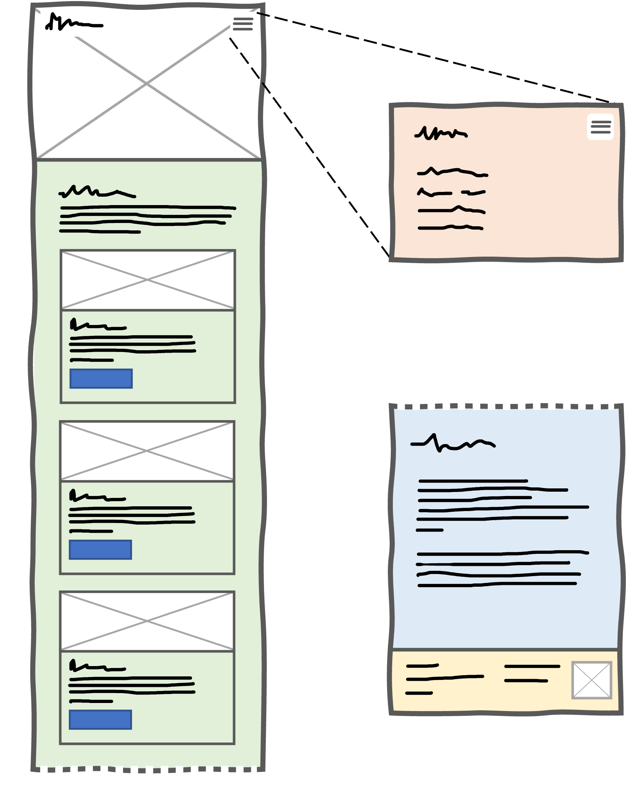
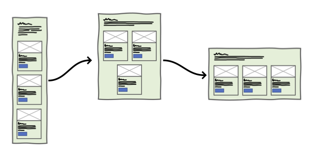
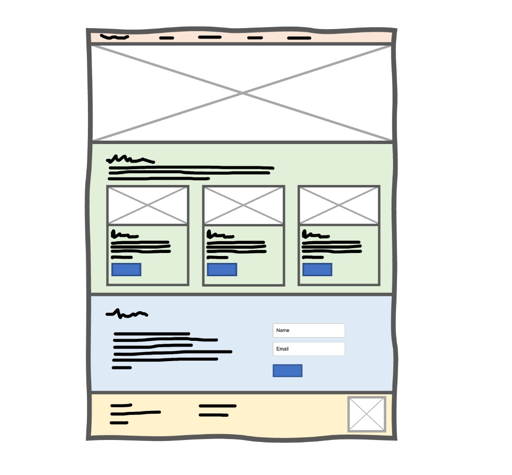
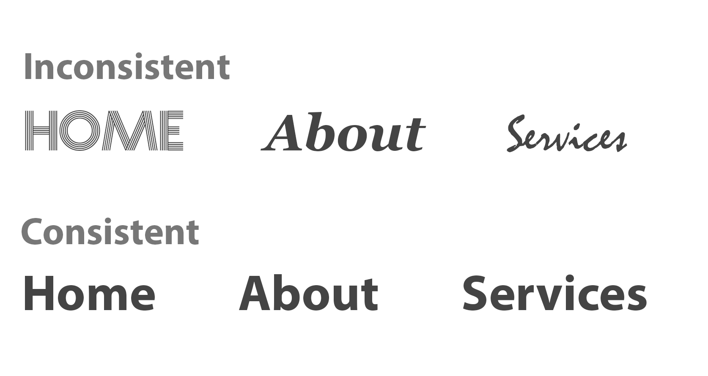
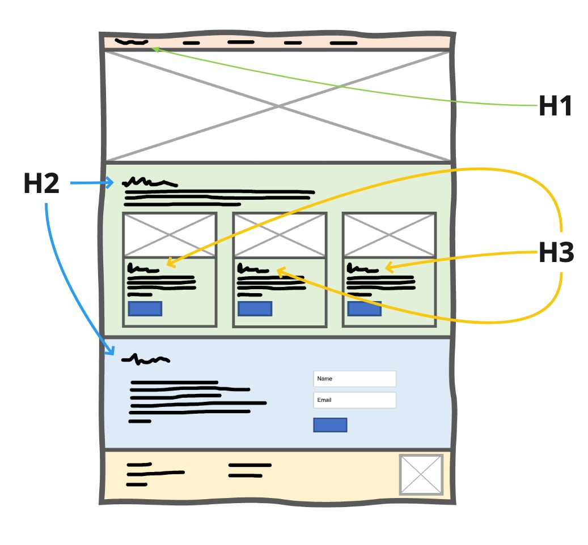

# Wireframing

Lesson duration: 45mins

## Learning Objectives:​
- Know how what "Mobile-First" means
- Understanding what a wireframe is and why we use them
- Gain the abaility to create a wireframe and that be used to make a website
- Knowing the meaning of consistancy and hierarchy within web design

## Building a Base

When it comes to building a skyscraper, planning is key. This is also true for websites. Anything built without proper foundations is going to falter in some capacity. For a skyscraper, this may be the building collapsing, and for websites, this may mean significant problems with maintainability or scalability. In an extreme case, poor planning could result in a complete loss of functionality for parts of a site. 

**Wireframes** are the first stage in website design, where space is assigned and outlined for different blocks of content, irrespective of the content which will fill said space. By planning out how content fills the space, and how each section or element relates to each other, we are provided with not only a visual representation of our site which we can eyeball and easily tweak but also a map for how we should build our site. HTML allows us to define not only the identity of each part of our site but also the context that it falls within. If created correctly, and annotated if needs be, a wireframe design should be a true representation of your HTML markup.

## Mobile-First Design

Since the middle of 2019, the majority of website traffic has consistently come from mobile devices.  Over the past two decades, there have been many developments in largely CSS which have allowed us to move past the need for multiple, distinct designs, each for a given set of devices (such as desktops, tablets or mobile phones). 

Traditionally, these designs shared some visual elements, such as colour schemes or images, to ensure cohesive branding, however, they were hosted as separate sites. How this generally worked was that the main site (hosted at *e.g.* `myfakewebsite.com`) would detect what kind of device you were on and then pass you onto the mobile site (*e.g.* `m.myfakewebsite.com`) if it saw you were on a mobile device.

But gone are the days of fragmented websites. With CSS properties such as Flexbox and Grid alongside the bolstered capabilities of media queries and devices in general, it is now common practice for us to develop a single site, which can adapt to suit whatever device it is being viewed on. The aim is for one design to exist across all devices but with this change has also come a change in attitude towards mobile sites. Previously, mobile sites were sometimes considered as an add-on, or a nice-to-have, whereas with the growing number of people using mobile devices as their primary viewing platform, there is an adjoined increase of focus on the mobile experience. With this change, designs are being constructed **_"mobile-first"_**.

## Wireframes - How?

We've talked about the *"Why?"* of wire-framing but we're yet to touch on the *"How?"*. There are many different design tools out there such as [Miro](https://miro.com/) or [Figma](https://Figma.com/) but if you fancy using a good-old pen and paper, feel free! To begin constructing your wireframe, start similarly as you would in your HTML document—with an outline of the entire page. Next, divide your page up into sections, mimicking the creation of parent `<header>`, `<footer>` and `<section>` elements within your code. Once each section is defined, generally, as full-width blocks, it's time to populate each area with content elements such as images or text paragraphs, again following the nested design of a webpage.

Remember, it's a good practice to take a *mobile-first* approach to wireframing, so let's start with a mobile wireframe.

> Note: we broke up the content (between the green and blue sections) for ease of viewing, you don't need to do this in your wireframe.

The example above shows how you could go about this process. We start with a blank sheet with the rough dimensions we expect our mobile website to be. We then subdivide this page into separate sections. This design is akin to many you will have seen yourselves. Going from top to bottom, the sections are:

- **Orange**: the header for our page. Likely to be a `<header>` element with a `<nav>` and `<ul>` nested within.
- **Clear box**: a *"hero"* or *"landing content"* section. Here, we've opted for a large image covering the whole section. This would be the first `<section>` within our `<main>` element.
- **Green**: the second section which holds informational content on the page. Here, we've created a small *" Featured Products"* section for our model shop page. This would similarly be a `<section>` within `<main>`, sat following the previous purple section.
- **Blue**: a tertiary content section with more words. This could be a brief *"About Us"* section. This would be the third, and final `<section>` within the `<main>` tag.
- **Yellow**: a footer. This acts as a complimentary navigation section to the header. All content would be wrapped in a `<footer>`.

If you're very new to HTML, some of these elements may be new to you. Don't worry, you will get used to using them. Luckily these elements are **semantic** elements. We will talk more about this in our accessibility lesson, but for now, you just need to know that they are elements that describe what they do.

Some of your initial thoughts may be along the lines of *"But I don't want five different coloured backgrounds on my page"* or *"This level of separation is needless"* however I urge you to remember that **the wireframe aims to provide a representation of your site, providing context** alongside visuals. And it is a plan, not the final product.

### From Mobile to Desktop
Now that we've made a simple mobile wireframe, we can bring it over to desktop. It's important here that we don't change our design fully, it simply needs to take up more space. That usually means that stacked elements could be side by side.

Notice how we have three versions of our wireframe in the above image; mobile, tablet and desktop. We have accounted for all screen sizes by adjusting how the product items are aligned. Our changes are minor between the screen sizes, and that will result in much less code later.

To finalise the rest of our wireframe, we' will make the whole wireframe desktop friendly. We'll skip past the tablet wireframe because it's not that necessary, we know how the wireframe will look mostly within tablets if we have the mobile and desktop wireframes.

Et voilà 🥖🇫🇷! We have created a beautiful mobile-first design that we can now use to build our website.

## Consistancy
It's important to be aware of consistency when it comes to a design. You may want to create a wild design with five different fonts and eight colours. I urge you to hold your horses 🐴. 

It's important to keep a design simple for your sake, as the developer, and for the person who ends up using your website (the user). It means writing less code and the code you do write will be more useful.

Take this example. We have two navigation menus, the first uses three different fonts, and the second that keeps the same font. This principle applies here, but also if you had a second page, for example, the navigation menu should remain the same font, size, colour etc.

## Hierarchy
It's essential to maintain a hierarchy within our design, which will  remain consistant within our code. It is vital not only because it's a principal of web-design, but also for accessability and also for Search Engine Optimizsation (SEO), which essentially means that once your website goes live on the internet, a search engine will scan it so it knows what people should search to find your website. Therefore, it's a good idea to keep the search engines happy.

If you remember from our first lesson, we mentioned we can only use a `h1` once. That's because the `h1` element is the most important on our webpage.

In the above example, you can see that we have marked what each title should be in regards to a `h1`, `h2` or `h3`. There can, of course be more headings on your page but our example is a simple website here, and it doesn't need any more than three headings.

## References
Stats on device site usage:
[https://www.statista.com/statistics/277125/share-of-website-traffic-coming-from-mobile-devices/](https://www.statista.com/statistics/277125/share-of-website-traffic-coming-from-mobile-devices/)