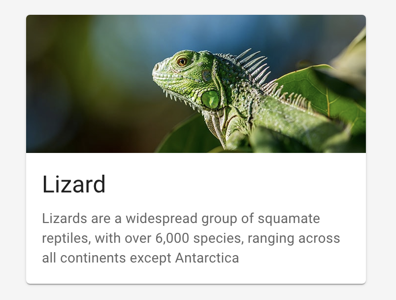
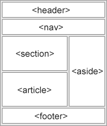
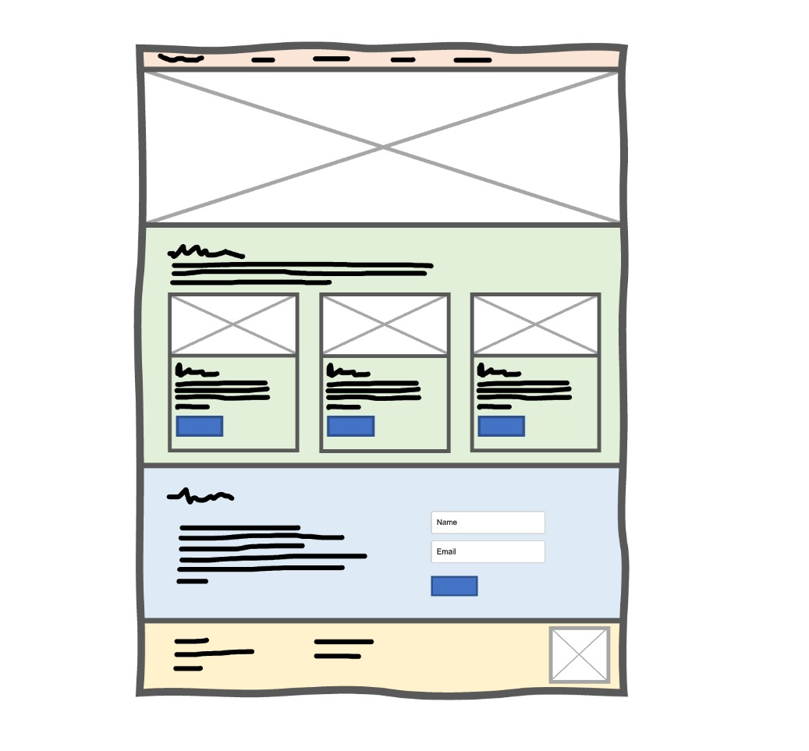
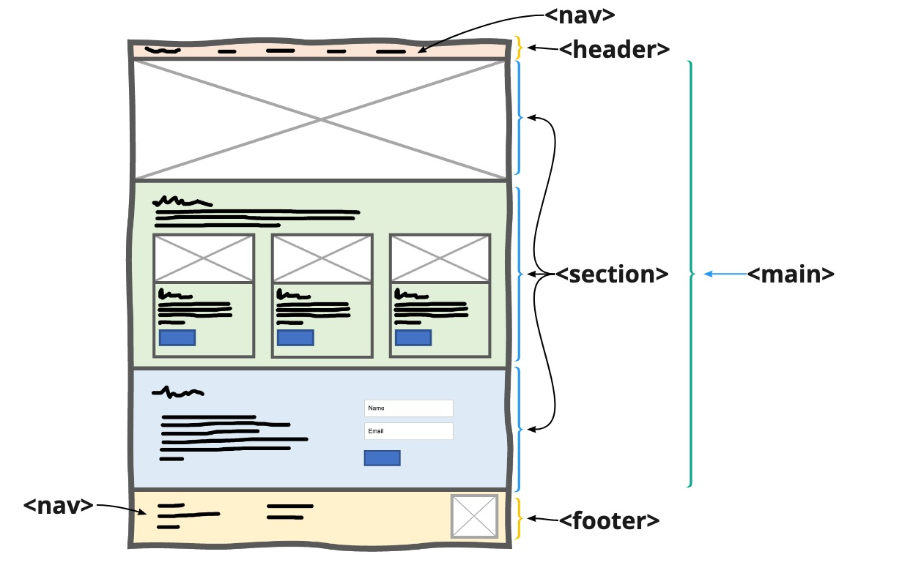

# Semantic HTML

Lesson duration: 60min

## Learning Objectives:​
- Understanding the meaning of Semantic HTML
- Develop a general understanding of common HTML elements like `div`, `img`, `a` etc.
- Develop an understanding of HTML semantic elements like `header`, `main`, `footer`, `nav` etc.
- Gain the ability to build a basic website in HTML

## What is Semantic HTML?
In a nutshell, a semantic element clearly describes the meaning to both the browser and the developer.

To understand this, we first need to understand what the problem was before semantic elements were introduced to HTML.

Introducing the `div` element. A div defines a **div**ision in an HTML document. It's used to group elements together. For example, imagine we want to build something like this.



This is called a "Card". You can see it contains three elements; An image, a title and a paragraph. So the HTML would roughly be something like:

```html
<div>
    
    <h3>Lizard</h3>
    <p>Lizards are a widespread group of... </p>
</div>
```

So we essentially group the `img`, `h3` and `p` tags together in this one `div`. This way our code is nicely organised, and it will be particularly useful later when we get into CSS.

This example is a perfectly fine way to use a `div` element. But the reason why Semantic elements had to be introduced is that developers had often found them in "div hell", where you nest divs within divs within divs and your code starts to look like spaghetti 🍝🤌.

Not only was this an issue for the developer, but also for search engines who were trying to dissect and understand the website.

Therefore, semantic elements were introduced like `header`, `nav`, `section`, `footer` etc. As a result, our website would start to look like this:



## Picking up where we left off
Remember that wireframe we made previously? Let's go ahead and build that using HTML.



The first thing we need to do is know which semantic elements we should use.

W3 Schools has plenty of info on this, if in doubt check the [Further Reading](#further-reading) section.



We have labelled the semantic elements we think should be used for this wireframe.

Let's go ahead and start creating it using HTML. You can take the code from the `code_start`, folder. It's pretty much just an empty HTML file.

### Building the Header
We're going to start with building the header section of our wireframe. Open up that `index.html` file and remove any HTML from the `<body>` section.

If you recall from the wireframe, we have a `<header>` with a `<nav>` inside of it, and also a logo. In this case, we don't have an image for our logo, so we will use a `<h1>` since it is our main title.

```html
<!-- index.html -->
...
<body>
   <header>
        <h1>Duck Appreciation Society</h1>
        <nav>
        </nav>
   </header>
</body>
</html>
```

There you have it! We've made a header with a title and a nav. The only issue is our nav is empty, and we want to add some links in there to match our wireframe.

If you ever want to add a link in HTML, you can use the `<a>` element. If we had more `.html` files in our folder, we could link to those, or we could link to an external website e.g.

```html
<a href="https://youtube.com">Go to youtube</a>
```

But for now, we have no links, so we will simply use a `#`, which is essentially just a placeholder.

```html

<!-- index.html -->
...
   <header>
    <h1>Duck Appreciation Society</h1>
    <nav>
        <a href="#">Home</a>
        <a href="#">Products</a>
        <a href="#">About</a>
        <a href="#">Contact</a>
    </nav>
   </header>
```
You can go ahead and open up that HTML file in your browser to see your beautiful work.

Woohoo! We've finished building the header! I know it ain't much but it's a good start.


### Main section

We can keep pushing and build the rest of the page. Underneath the `header`, make a new tag called `<main>`.

```html
<!-- index.html -->
    ...
    </header>
    <main>
        <!-- Section 1 -->
        <section></section>
        <!-- Section 2 -->
        <section></section>
        <!-- Section 3 -->
        <section></section>
    </main>
```

The `<main>` tag specifies the main content of a document. Within this, we will create a `<section>` for each section of our wireframe.

Our wireframe shows that the first section will just be an image, so we can leave that empty for now.

Within the second section, let's add some content. We can use [Lorem Ipsum](https://www.lipsum.com/), which is just random text generated to make the content feel filled up.

```html
    <!-- index.html -->
    ...
    <!-- Section 1 -->
    <section class="hero"></section>
    <!-- Section 2 -->
    <section class="products">
        <h2>Types of ducks I appreciate</h2>
        <p>Lorem ipsum dolor si...</p>
    </section>
    <!-- Section 3 -->
    <section class="contact"></section>
    ...
```

We have cut off the dummy content here, but you can grab it from the link above and paste it in. Notice how we've also added some class names to each section. This is just a way to label and target our content later using CSS.

Now let's build one of those cards within the second section. If we take a close look at one of the cards, it contains four elements; An image, a heading, a paragraph and a button.

So let's build up one of those cards:

```html
<!-- index.html > Section 2 -->
<div class="products__card">
    
    <h3>Card Title</h3>
    <p>Card paragraph</p>
    <button>Button</button>
</div>
```

We created a `div`, which will have all of our elements in there; an `img`, `h3`, `p` and a `button`.

If you added that into our second section, and open it up in the browser you should see our new elements appear on our page!

One issue however is that we don't have a real image in there. So let's add one. If you have an image of a duck on your computer already, you're ready to go. If not we just Googled one and saved the first one from Google Images.

Within your code folder, create a new folder called `assets` and place your new image in that directory. We named our image `duck.jpeg`.

Now we can link our image into our HTML file by modifying the `img` element:

```html

```
Now you should see your duck image on your HTML page! We're going to copy and paste that card 3 times so we have 3 cards within this section.

### Contact & Forms

Next we are going to build our contact section. It is our third and final section which will contain some text and a simple contact form.

If we look back to our wireframe, this section has a paragraph and a form side by side. We won't worry about aligning things side-by-side until we get to CSS, but let's build up this section in HTML.

```html
<!-- index.html -->
<section class="contact">
    <div class="contact__text">
        <h2>Contact me about ducks</h2>
        <p>Lorem ipsum dolor si...</p>
    </div>

    <div class="contact__form">
        <!-- Our form will go here -->
    </div>
</section>
```

Nothing new so far, we added two divs within our section, which will be the left and right aligned content on the page.

Let's go ahead and create a form within our `contact__form` div.

```html
<!-- index.html > div:contact__form -->
<form>
    <input type="text" name="name" placeholder="Your name" id="name">
    <input type="email" name="email" placeholder="Your email" id="email">
    <input type="submit" value="Submit">
</form>
```

A form has to contain input fields. An input field can have different types, for example above we use three different types; `text`, `email` and `submit`. There are many other types we can use but for now this is all we need for our simple form.

### Footer

The final thing we need to do is add a footer, and we are finished creating our website in HTML!

Similar to our header, our footer will contain a navigation, and a logo. For now, let's just use our duck image from before as a placeholder.

```html
<!-- index.html -->
...
</main>
<footer>
    <div class="footer__left">
        <nav>
            <a href="#">Home</a>
            <a href="#">About</a>
            <a href="#">Contact</a>
        </nav>
        <div>
            <a href="mailto:ducks@ducksociety.com">ducks@ducksociety.com</a>
            <a href="tel:+44 (5182) 797 9825">+44 (5182) 797 9825</a>
            <p> &copy; Duck Appreciation Society 2022</p>
        </div>
    </div>
    <div class="footer__right">
        
    </div>
</footer>
```
Our footer contains three items; a `nav` (the same as the one in the header), a `div` containing some contact and copyright information, and an image which can be our logo placeholder.

The only thing we haven't seen before is within the contact information section. You can see we used `a` tags, but instead of linking to a webpage, we can link to send an email, or call a phone.

Finally, we have a copyright symbol by using the `&copy;` code. This is a HTML symbol, and HTML will be able to translate this into the right symbol.

## Further Reading

W3 Schools has plenty of information on semantic elements and where they should be used: [https://www.w3schools.com/html/html5_semantic_elements.asp](https://www.w3schools.com/html/html5_semantic_elements.asp)

HTML Form Elements: (https://www.w3schools.com/html/html_form_elements.asp)[https://www.w3schools.com/html/html_form_elements.asp]

HTML Symbols: [https://www.w3schools.com/html/html_symbols.asp](https://www.w3schools.com/html/html_symbols.asp)

